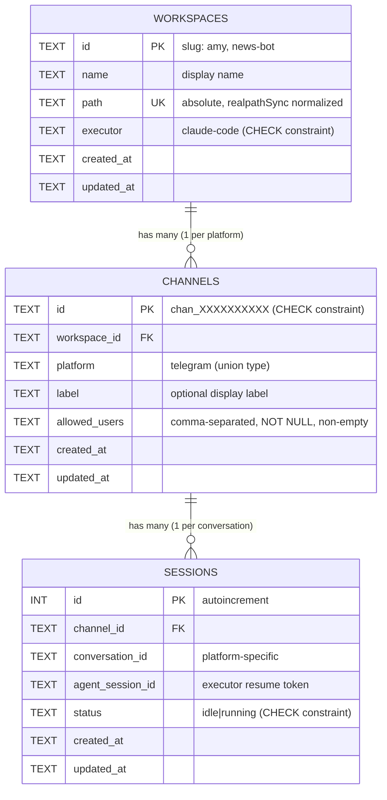

# Multi-Workspace Schema Migration

## Enhancement Summary

**Deepened on:** 2026-03-17
**Agents used:** TypeScript reviewer, security sentinel, architecture strategist, data integrity guardian, performance oracle, code simplicity reviewer, agent-native reviewer, best practices researcher, framework docs researcher, pattern recognition specialist

### Key Improvements from Research
1. **Chat SDK spike resolved** — `createTelegramAdapter` accepts `botToken` directly in config. No `process.env` mutation needed. Eliminates race condition risk entirely.
2. **`PRAGMA user_version` read pattern is broken** — current `db.pragma()` returns `void`. Must use `db.queryGet("PRAGMA user_version")` instead, or add `pragmaGet` to the DB interface.
3. **Path traversal vulnerability** in credential file operations — channel IDs used in file paths must be validated against a strict pattern.
4. **Union types** needed for `executor` and `platform` fields to get compile-time exhaustiveness checking.
5. **`allowedUsers` should be `string[]`** on domain interfaces, with serialization in the row converter.
6. **Startup caching** — channel/workspace data never changes at runtime (restart required); pre-parse into in-memory Maps at startup to eliminate per-message SQLite reads.
7. **nanoid** recommended for channel ID generation (custom alphabet, 118 bytes, cryptographic).
8. **Wrap migrations in transactions** — `PRAGMA user_version = N` is transactional in SQLite, making the entire migration atomic.

### Simplicity Reviewer Counter-Argument
The simplicity reviewer proposed deferring the entire plan and shipping a `--config-dir` flag instead (~20 LOC for multi-workspace via separate BAE processes). This is a legitimate alternative for the immediate term. However, the decision to proceed with the schema migration was made because: (a) zero users means zero migration cost, (b) Phase 3 (Slack) requires the channel abstraction anyway — two platforms sharing one process cannot be solved with `--config-dir`, and (c) the Tauri GUI (Phase 4) needs programmatic workspace/channel management, not multiple process orchestration.

**Items cut based on simplicity review:**
- `channels.config` JSON column — YAGNI, no concrete use case
- `bae channel update` command — remove+add achieves same result while restart is required
- Slack credential prompts — don't build UI for platforms that don't exist yet
- Executor factory file (`src/executor/factory.ts`) — inline the single-case creation in SessionManager until Phase 3

---

## Overview

Restructure BAE's data layer from single-workspace (one `BAE_CWD`, one bot token) to multi-workspace (N workspaces, each with N channels, each with N sessions). This is a **schema and plumbing change only** — no new platform adapters, no new executors. The existing single-workspace behavior continues to work — it's just one workspace with one channel.

## Problem Statement / Motivation

BAE currently hardcodes a single workspace (`BAE_CWD`) and a single bot token (`TELEGRAM_BOT_TOKEN`). This blocks:

- Multiple agent identities from one BAE process (research assistant + news bot)
- Multiple platform channels per workspace (Telegram + Slack for the same agent)
- Per-channel access control (different users for different agents)
- Clean Tauri GUI workspace management (Phase 4)
- Platform expansion (Phase 3 — Slack/Discord would build on wrong foundation)

Zero production users exist. Schema migration now costs nothing; after users exist, it costs migration tooling and backward compatibility.

See origin: `docs/specs/SPEC_MULTI_WORKSPACE.md` for full design rationale, hierarchy model, and naming decisions.

## Proposed Solution

Three new tables (`workspaces`, `channels`, `sessions` replacing current `sessions`), credentials moved to per-channel env files on disk, routing updated to resolve workspace from channel identity, and CLI commands for workspace/channel management.

### Why schema first, before Phase 3

| Order | Consequence |
|-------|------------|
| Schema first, then Slack | Slack adapter plugs into channel system cleanly. One problem at a time. |
| Slack first, then schema | Build Slack on single-workspace model, then immediately refactor. Wasted work. |

## Technical Approach

### Phase 1: Foundation — DB Interface, Schema, Types, Credentials

#### Step 1.1: Extend DB Interface with `queryAll`

**Critical prerequisite** (from institutional learnings: `docs/solutions/database-issues/cross-runtime-sqlite-adapter.md`).

The current `DB` interface only has `queryGet<T>()` for single-row queries. Multi-workspace needs to list workspaces and channels. Must add `queryAll<T>()` for both Bun and Node adapters.

```typescript
// src/session/db.ts — extend DB interface
interface DB {
  exec(sql: string): void;
  pragma(directive: string): void;
  queryGet<T>(sql: string, ...params: unknown[]): T | undefined;
  queryAll<T>(sql: string, ...params: unknown[]): T[];  // NEW
  run(sql: string, ...params: unknown[]): void;
  close(): void;
}
```

Implementation per runtime:
- **Bun**: `db.query(sql).all(...params)` — note: spread params, NOT array (documented gotcha)
- **Node (better-sqlite3)**: `db.prepare(sql).all(...params)`

### Research Insights: DB Interface

**Best practice (from best-practices researcher):** Also verify foreign keys are actually enabled after setting the pragma — add a paranoia check in init:
```typescript
const fk = db.queryGet<{ foreign_keys: number }>("PRAGMA foreign_keys");
if (!fk || fk.foreign_keys !== 1) throw new Error("Failed to enable foreign keys");
```

**Files:** `src/session/db.ts`

#### Step 1.2: Schema — New Tables

Replace existing `sessions` table with the three-table model. Add schema versioning via `PRAGMA user_version`.

```sql
CREATE TABLE IF NOT EXISTS workspaces (
  id          TEXT PRIMARY KEY,
  name        TEXT NOT NULL,
  path        TEXT NOT NULL UNIQUE,
  executor    TEXT NOT NULL DEFAULT 'claude-code'
    CHECK(executor IN ('claude-code')),
  created_at  TEXT NOT NULL DEFAULT (datetime('now')),
  updated_at  TEXT NOT NULL DEFAULT (datetime('now'))
);

CREATE TABLE IF NOT EXISTS channels (
  id            TEXT PRIMARY KEY
    CHECK(id GLOB 'chan_[a-z0-9]*'),
  workspace_id  TEXT NOT NULL REFERENCES workspaces(id) ON DELETE CASCADE,
  platform      TEXT NOT NULL,
  label         TEXT,
  allowed_users TEXT NOT NULL
    CHECK(length(trim(allowed_users)) > 0),
  created_at    TEXT NOT NULL DEFAULT (datetime('now')),
  updated_at    TEXT NOT NULL DEFAULT (datetime('now')),
  UNIQUE(workspace_id, platform)
);

CREATE TABLE IF NOT EXISTS sessions (
  id                INTEGER PRIMARY KEY AUTOINCREMENT,
  channel_id        TEXT NOT NULL REFERENCES channels(id) ON DELETE CASCADE,
  conversation_id   TEXT NOT NULL,
  agent_session_id  TEXT,
  status            TEXT NOT NULL DEFAULT 'idle'
    CHECK(status IN ('idle', 'running')),
  created_at        TEXT NOT NULL DEFAULT (datetime('now')),
  updated_at        TEXT NOT NULL DEFAULT (datetime('now')),
  UNIQUE(channel_id, conversation_id)
);

-- Index foreign key columns (SQLite does NOT auto-index FKs)
CREATE INDEX IF NOT EXISTS idx_channels_workspace ON channels(workspace_id);
CREATE INDEX IF NOT EXISTS idx_sessions_channel ON sessions(channel_id);
```

**Key design decisions (updated from reviews):**

- **`ON DELETE CASCADE`** on both FKs. Deleting a workspace cascades to its channels and their sessions. Application code handles credential file cleanup.
- **`allowed_users TEXT NOT NULL CHECK(length(trim(allowed_users)) > 0)`** — required AND non-empty. Empty allowlist = open access to your machine's CLI agent with `--dangerously-skip-permissions`. (Security sentinel finding #3)
- **`CHECK(status IN ('idle', 'running'))`** — prevent silent data corruption from bugs inserting unexpected values. (Data integrity finding)
- **`CHECK(id GLOB 'chan_[a-z0-9]*')`** on channels — prevents path traversal via malformed channel IDs in credential file paths. (Security sentinel finding #1)
- **`CHECK(executor IN ('claude-code'))`** on workspaces — documents currently valid set, update in future migrations.
- **`sessions.workspace_id` dropped** — denormalization removed. The workspace is always derivable from `channel_id → channels.workspace_id`. Eliminates data inconsistency risk. `clearWorkspaceSessions` uses a subquery instead. (TypeScript reviewer #15, data integrity #8)
- **`channels.config` column dropped** — YAGNI. No concrete use case exists. Add when needed. (Simplicity reviewer)
- **FK indexes added** — SQLite does not auto-index foreign key columns. Required for CASCADE delete performance. (Data integrity finding #1a, best practices researcher gotcha #4)

**Schema versioning pattern (fixed from data integrity review):**

The `db.pragma()` method returns `void` in the current DB interface. `PRAGMA user_version` must be read via `queryGet`:

```typescript
// In store init() — read version via queryGet, NOT pragma()
const row = db.queryGet<{ user_version: number }>("PRAGMA user_version");
const version = row?.user_version ?? 0;

if (version < 1) {
  db.exec("BEGIN");
  try {
    db.exec(SCHEMA_V1);
    db.exec("PRAGMA user_version = 1");
    db.exec("COMMIT");
  } catch (err) {
    db.exec("ROLLBACK");
    throw err;
  }
}
```

**Critical fix:** Without the transaction wrapper, a crash between schema creation and version bump leaves tables existing but version at 0. `CREATE TABLE IF NOT EXISTS` makes v1 idempotent, but future `ALTER TABLE` migrations (v1→v2) would fail. Wrapping in a transaction makes the entire migration atomic — `PRAGMA user_version = N` respects rollback in SQLite.

**Breaking schema change:** Existing databases (pre-migration) have `user_version = 0` and an incompatible `sessions` table. Since zero production users exist, the v0→v1 transition drops and recreates. No migration path needed pre-v1. State this explicitly.

**Files:** `src/session/store.ts`

#### Step 1.3: TypeScript Types

Extract types to dedicated file with union types for compile-time safety.

```typescript
// src/session/types.ts

// Union types — exhaustiveness checking in switch statements
export type ExecutorType = "claude-code";
// Phase 3: "claude-code" | "codex" | "opencode"

export type Platform = "telegram";
// Phase 3: "telegram" | "slack" | "discord"

export interface Workspace {
  id: string;              // slug: "amy", "news-bot"
  name: string;            // display: "Amy - Research Assistant"
  path: string;            // absolute: /Users/neethan/research
  executor: ExecutorType;
  createdAt: string;
  updatedAt: string;
}

export interface Channel {
  id: string;              // generated: "chan_k7x9m2a4bn"
  workspaceId: string;
  platform: Platform;
  label: string | null;
  allowedUsers: string[];  // PARSED — not comma-separated string
  createdAt: string;
  updatedAt: string;
}

export interface Session {
  id: number;
  channelId: string;
  conversationId: string;
  agentSessionId: string | null;
  status: "idle" | "running";
  createdAt: string;
  updatedAt: string;
}

// DB row types (snake_case) — internal to store, not exported
export interface WorkspaceRow {
  id: string;
  name: string;
  path: string;
  executor: string;
  created_at: string;
  updated_at: string;
}

export interface ChannelRow {
  id: string;
  workspace_id: string;
  platform: string;
  label: string | null;
  allowed_users: string;
  created_at: string;
  updated_at: string;
}

export interface SessionRow {
  id: number;
  channel_id: string;
  conversation_id: string;
  agent_session_id: string | null;
  status: string;
  created_at: string;
  updated_at: string;
}

// Row converters with runtime validation
function assertStatus(s: string): "idle" | "running" {
  if (s === "idle" || s === "running") return s;
  throw new Error(`Invalid session status: ${s}`);
}

export function toWorkspace(row: WorkspaceRow): Workspace {
  return {
    id: row.id,
    name: row.name,
    path: row.path,
    executor: row.executor as ExecutorType,
    createdAt: row.created_at,
    updatedAt: row.updated_at,
  };
}

export function toChannel(row: ChannelRow): Channel {
  return {
    id: row.id,
    workspaceId: row.workspace_id,
    platform: row.platform as Platform,
    label: row.label,
    allowedUsers: row.allowed_users.split(",").map(s => s.trim()).filter(Boolean),
    createdAt: row.created_at,
    updatedAt: row.updated_at,
  };
}

export function toSession(row: SessionRow): Session {
  return {
    id: row.id,
    channelId: row.channel_id,
    conversationId: row.conversation_id,
    agentSessionId: row.agent_session_id,
    status: assertStatus(row.status),
    createdAt: row.created_at,
    updatedAt: row.updated_at,
  };
}
```

### Research Insights: Types

- **Union types for `executor` and `platform`** eliminate runtime `default: throw` branches. The compiler enforces exhaustiveness in switch statements. (TypeScript reviewer #1, #2)
- **`allowedUsers: string[]`** on the domain interface eliminates repeated `.split(",").map(s => s.trim())` at every consumer. Parse once in `toChannel()`. (TypeScript reviewer #5)
- **Runtime validation** in `assertStatus()` instead of `as` cast. Catches silent data corruption from bugs. (TypeScript reviewer #11)
- **Row types are NOT exported** — internal to the store layer. Only domain interfaces are public. Matches existing pattern where `SessionRow` is not exported. (TypeScript reviewer #10)

**Channel ID generation:** Use `nanoid` with `customAlphabet("0123456789abcdefghijklmnopqrstuvwxyz", 10)`. Format: `chan_` prefix + 10 alphanumeric chars. Collision probability at 1,000 IDs/hour: 1% in ~35 years. Cryptographic randomness via `crypto.getRandomValues`. (Best practices researcher)

```typescript
import { customAlphabet } from "nanoid";
const generateId = customAlphabet("0123456789abcdefghijklmnopqrstuvwxyz", 10);
export const channelId = () => `chan_${generateId()}`;
```

**New dependency:** `nanoid` (118 bytes, ESM-only, matches BAE's `"type": "module"`).

**Files:** New `src/session/types.ts`

#### Step 1.4: Credential Storage

Move secrets from `~/.bae/.env` to per-channel credential files.

```
~/.bae/
  ├── bae.db
  ├── .env                  # GLOBAL non-secret config only: BAE_PORT
  └── credentials/
      └── {channel_id}.env  # Platform-specific secrets (mode 0600)
```

**Decision: `~/.bae/.env` is NOT eliminated.** It continues to hold global non-secret config (`BAE_PORT`). Credentials and workspace/channel config move to DB + credential files.

```typescript
// src/credentials.ts

import { parseEnvFile } from "./cli/env.ts";  // reuse existing parser
import { join, resolve, sep } from "node:path";
import { mkdirSync, writeFileSync, unlinkSync } from "node:fs";
import { homedir } from "node:os";

const CREDENTIALS_DIR = join(homedir(), ".bae", "credentials");

// Path traversal guard (security sentinel finding #1)
function safeCredentialPath(channelId: string): string {
  if (!/^chan_[a-z0-9]{10}$/.test(channelId)) {
    throw new Error(`Invalid channel ID format: ${channelId}`);
  }
  const resolved = resolve(CREDENTIALS_DIR, `${channelId}.env`);
  if (!resolved.startsWith(CREDENTIALS_DIR + sep)) {
    throw new Error("Path traversal detected in channel ID");
  }
  return resolved;
}

export function readChannelCredentials(channelId: string): Record<string, string> {
  return parseEnvFile(safeCredentialPath(channelId));
}

export function writeChannelCredentials(
  channelId: string,
  vars: Record<string, string>,
): void {
  mkdirSync(CREDENTIALS_DIR, { recursive: true, mode: 0o700 });
  const content = Object.entries(vars)
    .map(([k, v]) => {
      // Quote values containing special characters
      if (v.includes("\n") || v.includes('"') || v.includes(" ")) {
        return `${k}="${v.replace(/"/g, '\\"')}"`;
      }
      return `${k}=${v}`;
    })
    .join("\n");
  writeFileSync(safeCredentialPath(channelId), content + "\n", { mode: 0o600 });
}

export function deleteChannelCredentials(channelId: string): void {
  try {
    unlinkSync(safeCredentialPath(channelId));
  } catch (err: unknown) {
    // Only swallow "file not found" — rethrow permission errors etc.
    if (err instanceof Error && "code" in err && (err as NodeJS.ErrnoException).code !== "ENOENT") {
      throw err;
    }
  }
}
```

### Research Insights: Credentials

- **Path traversal guard** validates channel ID format AND checks resolved path stays within credentials dir. `join()` can resolve `../../etc/passwd` to arbitrary paths. (Security sentinel finding #1 — HIGH severity)
- **Function named `readChannelCredentials`** not `loadChannelCredentials` — in the existing codebase, `load` means "read AND write to process.env" (`loadEnvFile`). This function only reads. (Pattern recognition #3)
- **Narrow error catch** in delete — only swallows ENOENT, not permission errors. (TypeScript reviewer #13)
- **Value quoting** — handles newlines and special characters in credential values. (TypeScript reviewer #12)
- **Credential file cleanup order:** Delete credential files BEFORE database records on workspace/channel removal. Orphaned DB entries without credential files are handled gracefully (channel skipped at startup). Orphaned credential files with valid tokens are a security risk. (Security sentinel finding #6)

**Files:** New `src/credentials.ts`

### Phase 2: Store & Manager Refactoring

#### Step 2.1: Store Refactor

Rename `SessionStore` to `Store` (it now manages workspaces, channels, AND sessions — the old name undersells its scope). (Architecture strategist recommendation #5.3)

```typescript
// src/session/store.ts — updated API (renamed from SessionStore)

// Workspace operations
createWorkspace(opts: { id: string; name: string; path: string; executor?: ExecutorType }): Workspace
getWorkspace(id: string): Workspace | undefined
listWorkspaces(): Workspace[]
setWorkspaceExecutor(id: string, executor: ExecutorType): void
deleteWorkspace(id: string): void  // CASCADE handles channels + sessions

// Channel operations — ID generated internally by store
createChannel(opts: {
  workspaceId: string;
  platform: Platform;
  label?: string;
  allowedUsers: string[];
}): Channel  // returns created channel with generated ID
getChannel(id: string): Channel | undefined
getChannelsByWorkspace(workspaceId: string): Channel[]
listChannels(): Channel[]
deleteChannel(id: string): void  // CASCADE handles sessions

// Session operations
getOrCreateSession(channelId: string, conversationId: string): Session
setAgentSessionId(sessionId: number, agentSessionId: string): void
setStatus(sessionId: number, status: "idle" | "running"): void
clearSession(sessionId: number): void
clearWorkspaceSessions(workspaceId: string): void
  // UPDATE sessions SET agent_session_id = NULL
  // WHERE channel_id IN (SELECT id FROM channels WHERE workspace_id = ?)
```

### Research Insights: Store

- **Renamed `SessionStore` → `Store`** — it manages three entities now. (Architecture strategist #5.3)
- **`set*` prefix** for single-field updates (`setWorkspaceExecutor`, not `updateWorkspaceExecutor`) — matches existing `setAgentSessionId`, `setStatus` pattern. (Pattern recognition #3)
- **`listChannels()`** not `listAllChannels()` — consistent with `listWorkspaces()`. The "All" suffix is unnecessary; `getChannelsByWorkspace()` is the filtered variant. (Pattern recognition #7a)
- **Channel ID generated inside `createChannel`** — the store owns ID generation, not the CLI. Eliminates contradictory ownership between plan steps. (Pattern recognition #7d)
- **`getOrCreateSession` resolves workspace_id via subquery** since `workspace_id` was dropped from sessions table.
- **Path normalization uses `realpathSync`** — resolves symlinks AND macOS case-insensitivity in one call. Fallback to `resolve()` for not-yet-created directories. (Data integrity findings #7a, #7b)
- **Wrap workspace + channel creation in a transaction** during `bae init` — either both DB records exist or neither does. (Data integrity finding #5a)
- **Startup foreign key integrity check** — optionally run `PRAGMA foreign_key_check` to detect orphaned rows. (Best practices researcher)

**Files:** `src/session/store.ts`

#### Step 2.2: Session Manager Update

The session manager gains workspace-aware routing. **No executor factory file** — inline the single-case creation until Phase 3 adds a second executor.

**Current signature:** `handleMessage(platform: string, threadId: string, text: string)`
**New signature:** `handleMessage(channelId: string, conversationId: string, text: string)`

```typescript
// src/session/manager.ts — key changes

export class SessionManager {
  private store: Store;
  private activeHandles: Map<string, ExecuteResult>;  // channelId:conversationId -> handle
  private idleTimers: Map<string, ReturnType<typeof setTimeout>>;

  constructor(store: Store, idleTimeoutMs?: number) {
    // No longer takes a single executor — creates per workspace
  }

  private createExecutor(executor: ExecutorType): Executor {
    switch (executor) {
      case "claude-code":
        return new ClaudeCodeExecutor();
      // Phase 3: case "codex": return new CodexExecutor();
    }
    // exhaustive — TypeScript errors if a new ExecutorType is added without a case
  }

  async handleMessage(channelId: string, conversationId: string, text: string) {
    const handleKey = `${channelId}:${conversationId}`;

    // 1. Check for active handle (steering fast path) — same as before
    const existingHandle = this.activeHandles.get(handleKey);
    if (existingHandle?.send) { /* steer */ }

    // 2. Resolve workspace from channel
    const channel = this.store.getChannel(channelId);
    if (!channel) throw new Error(`Unknown channel: ${channelId}`);
    const workspace = this.store.getWorkspace(channel.workspaceId);
    if (!workspace) throw new Error(`Unknown workspace: ${channel.workspaceId}`);

    // 3. Create executor for this workspace's type
    const executor = this.createExecutor(workspace.executor);

    // 4. Get or create session
    const session = this.store.getOrCreateSession(channelId, conversationId);

    // 5. Execute with workspace path as cwd
    const result = executor.execute({
      prompt: text,
      cwd: workspace.path,
      resumeSessionId: session.agentSessionId ?? undefined,
    });

    // 6. Track handle, start idle timer — same as before
  }
}
```

### Research Insights: Session Manager

- **No executor factory file** — the `createExecutor` method is inline in the manager. A one-case switch wrapped in a separate file is pure indirection with no branching value. Extract to a file when Phase 3 adds a second executor. (Simplicity reviewer)
- **No executor cache** — `ClaudeCodeExecutor` is stateless (just calls `spawn`). Caching it per workspace adds cognitive load for zero functionality. Create fresh per message. (Simplicity reviewer)
- **Exhaustive switch** — with `ExecutorType` union, TypeScript errors if a new variant is added without a case. No `default: throw` needed. (TypeScript reviewer #3)
- **Handle key safety** — `channelId` has format `chan_XXXXXXXXXX` (no colon), `conversationId` is a numeric chat ID (no colon). The colon separator is collision-free. (TypeScript reviewer #16)

**Files:** `src/session/manager.ts`

### Phase 3: Bridge, Bot, and Commands

#### Step 3.1: Bridge Update

`BridgeConfig` simplifies — the bridge receives a `Store` instance rather than creating one internally. (Architecture strategist recommendation #5.1)

```typescript
// src/bridge.ts

export interface BridgeConfig {
  store: Store;
}

export async function createBridge(config: BridgeConfig): Promise<BridgeHandle> {
  const { store } = config;
  const manager = new SessionManager(store);

  async function handleMessage(
    thread: Thread,
    message: Message,
    channelId: string,
  ): Promise<void> {
    // 1. Auth check — per-channel, using pre-parsed string[]
    const channel = store.getChannel(channelId);
    if (!channel) return;

    const senderId = String(message.user?.id ?? "");
    if (!channel.allowedUsers.includes(senderId)) {
      await thread.sendMessage("Unauthorized.");
      return;
    }

    // 2. Extract conversationId from thread context
    const conversationId = String(thread.id);

    // 3. Command check
    const commandResult = handleCommand(text, manager, channelId, conversationId);
    if (commandResult) { return; }

    // 4. Dispatch to session manager
    const events = await manager.handleMessage(channelId, conversationId, text);

    // 5. consumeAllTurns — same streaming logic, unchanged
    consumeAllTurns(thread, events);
  }

  return { handleMessage, shutdown: () => manager.shutdown() };
}
```

### Research Insights: Bridge

- **Store injected, not created internally** — improves testability (pass in-memory store in tests), prevents double-construction (both CLI and bridge creating separate stores), and makes the dependency explicit. (Architecture strategist #5.1)
- **Auth check uses `channel.allowedUsers` which is already `string[]`** — no per-message `.split(",").map().trim()`. Parsed once in `toChannel()`. (Performance oracle #6)
- **Performance note:** For additional optimization, channel/workspace data could be pre-loaded into in-memory Maps at startup since they never change during a running process (restart required for config changes). This eliminates per-message SQLite reads entirely. (Performance oracle #1) — implement if profiling shows need, not preemptively.

**Files:** `src/bridge.ts`

#### Step 3.2: Bot Factory Update

**Chat SDK spike resolved!** The `createTelegramAdapter` accepts `botToken` directly in the config object. No `process.env` mutation needed. This eliminates the race condition risk entirely. (Framework docs researcher — confirmed by reading `node_modules/@chat-adapter/telegram/dist/index.js` line 212)

```typescript
// src/bot.ts — updated signature using options object

export interface CreateBotOptions {
  platform: Platform;
  credentials: Record<string, string>;
  channelId: string;
  onMessage: (thread: Thread, message: MessageData) => Promise<void>;
}

export function createBot(options: CreateBotOptions): BotHandle {
  const { platform, credentials, channelId, onMessage } = options;

  if (platform === "telegram") {
    // Pass token DIRECTLY — no process.env mutation!
    const adapter = createTelegramAdapter({
      botToken: credentials.TELEGRAM_BOT_TOKEN,
      mode: "auto",
    });

    // Separate state adapter per instance (prevents dedup key collisions
    // when two bots are in the same Telegram group)
    const state = createRetryState();

    const bot = new Chat({
      adapters: { telegram: adapter },
      state,
    });

    // ... HTML override, message handlers (same as current, with channelId baked in)

    return {
      start: async () => { await bot.initialize(); },
      stop: async () => {
        // IMPORTANT: Chat.shutdown() does NOT stop polling!
        await adapter.stopPolling();
        await bot.shutdown();
      },
    };
  }

  throw new Error(`Unsupported platform: ${platform}`);
}
```

### Research Insights: Bot Factory

- **`botToken` passed directly in config** — `createTelegramAdapter({ botToken })` reads this first, falls back to `process.env.TELEGRAM_BOT_TOKEN` only if not provided. Confirmed by reading adapter source. Eliminates entire race condition concern. (Framework docs researcher — critical finding)
- **Options object pattern** — matches `createBridge(config)` and `executor.execute(options)` conventions. Four positional args violates the existing pattern. (Pattern recognition #1)
- **Separate state adapter per instance** — prevents dedup key collisions. Two bots in the same group would have identical thread IDs (`telegram:{chatId}`). Shared state adapter would cause the second bot to skip messages. (Framework docs researcher)
- **`adapter.stopPolling()` must be called explicitly** — `Chat.shutdown()` only disconnects state and resets flags. It does NOT stop polling. Without this, polling loops leak on shutdown. (Framework docs researcher — critical finding)
- **Bot startup can be parallelized** — since no `process.env` mutation, all bots can be created and initialized in parallel with `Promise.allSettled`. No sequential constraint needed. (Performance oracle #5)

**Env var stripping in executor:** Continue stripping `TELEGRAM_BOT_TOKEN` from the executor's spawn environment (already done in current code). Even though we no longer set it in `process.env`, it may be set by the user's shell. (Security sentinel #2)

**Files:** `src/bot.ts`

#### Step 3.3: Commands Update

`handleCommand` signature changes from `(text, sessionManager, platform, threadId)` to `(text, sessionManager, channelId, conversationId)`.

**Decision: `/start` messages stay generic (not per-workspace identity).** Per-workspace greeting is a nice-to-have for later.

**Files:** `src/commands.ts`

#### Step 3.4: Inject Workspace Metadata into Spawned Agents

When the executor spawns a CLI agent, inject workspace context as environment variables so the agent can introspect its own configuration. (Agent-native reviewer finding #2)

```typescript
// In ClaudeCodeExecutor.execute() — add to env
env.BAE_WORKSPACE_ID = options.workspaceId;      // "amy"
env.BAE_WORKSPACE_NAME = options.workspaceName;   // "Amy - Research Assistant"
env.BAE_CHANNEL_ID = options.channelId;           // "chan_k7x9m2a4bn"
env.BAE_CHANNEL_PLATFORM = options.platform;      // "telegram"
```

This requires extending `ExecuteOptions` with optional workspace metadata fields.

**Files:** `src/executor/types.ts`, `src/executor/claude.ts`

### Phase 4: CLI Commands

#### Step 4.1: Workspace CLI Commands

```bash
bae workspace list
bae workspace add <slug> --name "Amy" --path ~/research [--executor claude-code]
bae workspace remove <slug> [--force]
bae workspace set-executor <slug> <executor>
```

**Validation rules:**
- Slug: `^[a-z0-9][a-z0-9-]{0,31}$` (lowercase, hyphens, 1-32 chars)
- Path: normalized via `realpathSync()` (resolves symlinks + macOS case). Blocked paths: `/`, `/etc`, `/usr`, `/var`, `/System`, `homedir()` exact match, `~/.bae`. (Security sentinel #4)
- Executor: must be in `ExecutorType` union (TypeScript enforces this)
- `bae workspace remove`: check PID file for running BAE process, refuse if running. (Security sentinel #8)

**Credential cleanup order:** Delete credential files for channels BEFORE `deleteWorkspace()`. (Security sentinel #6)

**Files:** New `src/cli/workspace.ts`

#### Step 4.2: Channel CLI Commands

```bash
bae channel list [--workspace <slug>]
bae channel add <workspace-slug> --platform telegram [--label "Amy on Telegram"]
bae channel remove <channel-id> [--force]
```

**`bae channel add` prompts for credentials and validates against platform API.** `allowed_users` is required (at least one user ID).

**`bae channel remove`**: check PID file for running BAE process, refuse if running. (Security sentinel #8)

**No `bae channel update`** — remove+add achieves the same result while restart is required. Add later if friction emerges. (Simplicity reviewer)

**Files:** New `src/cli/channel.ts`

#### Step 4.3: Init Update

`bae init` remains the simple one-command onboarding path.

**Default workspace slug/name:** basename of the chosen workspace path, lowercased, sanitized to slug format. Example: `~/research` → slug `research`, name `research`.

**Re-run behavior:** Idempotent. If workspace with derived slug exists, update it. If channel for that workspace + platform exists, update credentials. (SpecFlow gap #20)

**Transaction safety:** Wrap workspace + channel DB creation in a single transaction. Write credential file before the transaction (can be cleaned up if transaction fails). (Data integrity #5a)

**Files:** `src/cli/init.ts`

#### Step 4.4: Start Update — Multi-Channel Boot Loop

```typescript
async function start() {
  loadEnvFile(ENV_FILE);  // BAE_PORT only

  const store = new Store();
  await store.waitReady();

  const channels = store.listChannels();
  if (channels.length === 0) {
    console.error("No channels configured. Run `bae init` or `bae workspace add` + `bae channel add`.");
    process.exit(1);
  }

  const bridge = await createBridge({ store });

  // Boot all channels in PARALLEL (no env var race — tokens passed directly)
  const botResults = await Promise.allSettled(
    channels.map(async (channel) => {
      const creds = readChannelCredentials(channel.id);
      if (Object.keys(creds).length === 0) {
        console.warn(`Skipping channel ${channel.label ?? channel.id}: no credentials`);
        return null;
      }
      const workspace = store.getWorkspace(channel.workspaceId);
      const bot = createBot({
        platform: channel.platform,
        credentials: creds,
        channelId: channel.id,
        onMessage: (thread, message) => bridge.handleMessage(thread, message, channel.id),
      });
      await bot.start();
      console.log(`Channel ${channel.label ?? channel.id} (${channel.platform}) started`);
      return bot;
    })
  );

  const bots = botResults
    .filter((r): r is PromiseFulfilledResult<BotHandle> => r.status === "fulfilled" && r.value !== null)
    .map((r) => r.value);

  if (bots.length === 0) {
    console.error("No channels started successfully.");
    process.exit(1);
  }

  // HTTP server, PID file, graceful shutdown — same as current
  // Shutdown: stop all bots (including adapter.stopPolling()), then bridge
}
```

### Research Insights: Startup

- **Parallel bot creation** — now possible since tokens are passed directly to adapter constructor. No `process.env` race. Reduces startup from O(N × RTT) to O(1 × RTT). (Performance oracle #5, framework researcher)
- **`Promise.allSettled`** — one bad channel doesn't crash the others. Partial failure handling preserved.
- **Store constructed once in CLI, passed to bridge** — single owner, no double-construction. (Architecture strategist #5.1)

**Files:** `src/cli.ts`

### Phase 5: Tests, Docs, API

#### Step 5.1: Tests

| Test file | What it covers |
|-----------|---------------|
| `src/session/db.test.ts` | `queryAll` works, `PRAGMA user_version` readable via `queryGet` |
| `src/session/store.test.ts` | Workspace CRUD, channel CRUD (ID generation), session CRUD, CASCADE deletes, path normalization (`realpathSync`), schema versioning, foreign key enforcement |
| `src/credentials.test.ts` | Read/write/delete, file permissions, path traversal guard, missing file, special characters in values |
| `src/session/manager.test.ts` | **Update existing**: change routing to `(channelId, conversationId)`, create test workspace + channel in `beforeEach`, test workspace-aware executor creation. Note: `createMockExecutor` setup changes — manager no longer takes executor in constructor. |

#### Step 5.2: Read-Only HTTP API

Add basic read-only API routes to the existing Hono server. Enables Tauri GUI (Phase 4), monitoring scripts, and agent introspection. (Agent-native reviewer #6)

```typescript
// src/server.ts — add routes
app.get("/api/workspaces", (c) => c.json(store.listWorkspaces()));
app.get("/api/workspaces/:id", (c) => {
  const ws = store.getWorkspace(c.req.param("id"));
  return ws ? c.json(ws) : c.notFound();
});
app.get("/api/workspaces/:id/channels", (c) =>
  c.json(store.getChannelsByWorkspace(c.req.param("id")))
);
```

~30 lines. Write endpoints deferred to Phase 4 (Tauri).

**Files:** `src/server.ts`

#### Step 5.3: Documentation Updates

| Document | Changes |
|----------|---------|
| `docs/ARCHITECTURE.md` | Update component diagram, add workspace/channel concepts, update session store section |
| `docs/SPEC_SESSION.md` | Update schema and routing (currently stale) |
| `docs/specs/SPEC_MULTI_WORKSPACE.md` | Update `allowed_users TEXT` to `TEXT NOT NULL`, drop `config` column, drop `sessions.workspace_id` |
| `src/index.ts` | Export new types: `Workspace`, `Channel`, updated `Session`, `Store` |

## System-Wide Impact

### Interaction Graph

```
Message arrives on Telegram
  → Chat SDK adapter (constructed with botToken directly, tagged with channelId)
  → bridge.handleMessage(thread, message, channelId)
    → store.getChannel(channelId) → Channel { workspaceId, allowedUsers[] }
    → Auth check: senderId in channel.allowedUsers (pre-parsed Set)
    → store.getWorkspace(workspaceId) → Workspace { path, executor }
    → handleCommand(text, manager, channelId, conversationId) OR
    → manager.handleMessage(channelId, conversationId, text)
      → Check activeHandles[channelId:conversationId] → steer or spawn
      → If spawn: createExecutor(workspace.executor) → execute({ cwd: workspace.path })
      → Inject BAE_WORKSPACE_ID, BAE_CHANNEL_ID into spawned agent env
      → Track handle, start idle timer
    → consumeAllTurns(thread, events) → stream to Telegram
```

### Error Propagation

| Error | Source | Handling |
|-------|--------|----------|
| Invalid credentials at startup | `bot.start()` / `bot.initialize()` | `Promise.allSettled` catches per-channel. Log warning, skip. |
| Channel not found | `store.getChannel()` | Log error, ignore message |
| Workspace folder missing at spawn | `executor.execute()` | Error event to user via IM |
| Credential file corrupted | `readChannelCredentials()` | Returns `{}` → channel skipped at startup |
| DB locked | SQLite `busy_timeout` (5s) | Automatic retry — same as current |
| Executor spawn failure | `child_process.spawn` | Error event to user — same as current |
| Bot token in error URL | `validateCredentials` fetch | Catch and sanitize — don't propagate raw URL (Security sentinel #9) |

### State Lifecycle Risks

| Risk | Mitigation |
|------|-----------|
| Orphaned sessions after workspace delete | `ON DELETE CASCADE` on channels, sessions |
| Orphaned credential files after channel delete | Delete cred files BEFORE DB records |
| Stale `agent_session_id` after executor swap | `setWorkspaceExecutor` → `clearWorkspaceSessions` |
| Active process when workspace removed while running | CLI checks PID file, refuses if running |
| Partial migration on crash | Transaction-wrapped migration + version bump |
| Foreign key violations from bugs | `PRAGMA foreign_key_check` at startup (optional) |

### API Surface Parity

| Interface | Changes |
|-----------|---------|
| `Store` (was `SessionStore`) | New workspace/channel CRUD, updated session methods |
| `SessionManager.handleMessage` | `(platform, threadId, text)` → `(channelId, conversationId, text)` |
| `createBridge(config)` | `BridgeConfig` receives `Store` instance, loses `cwd`/`allowedUsers` |
| `createBot(options)` | Options object: `{ platform, credentials, channelId, onMessage }` |
| `handleCommand(...)` | `(text, manager, platform, threadId)` → `(text, manager, channelId, conversationId)` |
| `ExecuteOptions` | Gains optional `workspaceId`, `workspaceName`, `channelId`, `platform` |
| Public API (`src/index.ts`) | New exports: `Workspace`, `Channel`, `Store`, `ExecutorType`, `Platform` |
| HTTP API | New: `GET /api/workspaces`, `/api/workspaces/:id`, `/api/workspaces/:id/channels` |

## Edge Cases

| Scenario | Behavior |
|----------|----------|
| No workspaces configured | `bae start` errors: "No channels configured. Run `bae init`." |
| Channel credential file missing at startup | Skip channel, log warning. Other channels work. |
| Channel credential file corrupted | Same as missing — `parseEnvFile` returns `{}`, channel skipped. |
| Workspace folder deleted while BAE is running | Executor spawn fails → error event sent to user via IM. |
| Two channels for same platform on same workspace | Blocked by `UNIQUE(workspace_id, platform)`. CLI rejects. |
| `bae init` re-run with existing workspace | Idempotent update: updates workspace, updates channel credentials. |
| Delete workspace with `ON DELETE CASCADE` | Channels and sessions deleted. Credential files deleted by app code (BEFORE DB delete). |
| Executor swap with active sessions | `set-executor` clears all `agent_session_id` values. Active processes killed on next message. |
| Multiple users DM the same bot | Each user gets own session (`conversation_id` = their chat ID). Auth per-channel. |
| `bae workspace/channel remove` while BAE running | Refused — CLI checks PID file first. |
| Slug collision | PRIMARY KEY violation → clear error: "Workspace 'amy' already exists." |
| Path collision (including symlinks) | UNIQUE violation after `realpathSync` normalization → clear error. |
| Channel ID with path traversal chars | CHECK constraint + regex validation in credential functions → rejected. |
| Empty `allowed_users` on channel | CHECK constraint rejects: `CHECK(length(trim(allowed_users)) > 0)`. |

## ERD Diagram



## Acceptance Criteria

### Functional Requirements

- [ ] `bae workspace add/list/remove/set-executor` works
- [ ] `bae channel add/list/remove` works
- [ ] `bae channel add` validates credentials against platform API
- [ ] Credential files stored in `~/.bae/credentials/` with mode 0600
- [ ] Channel ID format validated: `chan_[a-z0-9]{10}`
- [ ] Path traversal guard on all credential file operations
- [ ] `bae init` creates default workspace + channel (backward-compatible)
- [ ] `bae init` re-run is idempotent
- [ ] `bae start` boots all channels in parallel
- [ ] `bae start` skips channels with missing/invalid credentials, continues with others
- [ ] Messages route correctly: channel → workspace → executor → response
- [ ] Per-channel `allowed_users` enforced (pre-parsed `string[]`)
- [ ] Sessions resume correctly per `(channel_id, conversation_id)`
- [ ] `/new` clears session within a channel
- [ ] `bae workspace set-executor` clears stale `agent_session_id` values
- [ ] `bae workspace remove` and `bae channel remove` refuse while BAE is running
- [ ] Cascade deletes work correctly with credential file cleanup
- [ ] No secrets stored in SQLite database
- [ ] Workspace metadata injected as env vars into spawned agents
- [ ] Read-only HTTP API for workspaces and channels

### Non-Functional Requirements

- [ ] Schema versioning via `PRAGMA user_version` (read via `queryGet`)
- [ ] Migration wrapped in transaction (atomic version bump)
- [ ] `queryAll` works on both Bun and Node runtimes
- [ ] Foreign key indexes on `channels.workspace_id` and `sessions.channel_id`
- [ ] CHECK constraints on `status`, `executor`, `channel.id`, `allowed_users`
- [ ] Bot tokens passed directly to adapter constructor (no `process.env` mutation)
- [ ] Separate state adapter per Chat SDK instance (no dedup collisions)
- [ ] `adapter.stopPolling()` called on shutdown
- [ ] `bun run check` (tsc) passes
- [ ] `bun run lint` (biome) passes

### Quality Gates

- [ ] Store tests: workspace CRUD, channel CRUD (with ID generation), session CRUD, cascade deletes, path normalization, schema versioning, FK enforcement
- [ ] Manager tests: updated routing params, workspace-aware executor creation
- [ ] Credential tests: read/write/delete, path traversal guard, special characters
- [ ] DB tests: `queryAll` on both runtimes, `PRAGMA user_version` via `queryGet`
- [ ] Manual test: full onboarding flow (`bae init` → `bae start` → Telegram → response)

## Implementation Steps

1. [ ] **Extend DB interface** — add `queryAll<T>()`, implement for Bun and Node, add test
2. [ ] **Types** — create `src/session/types.ts` with union types, domain interfaces, row types, converters with runtime validation. Add `nanoid` dependency.
3. [ ] **Schema** — replace current table with three-table model, `PRAGMA user_version` via `queryGet`, transaction-wrapped migration, CHECK constraints, FK indexes
4. [ ] **Credential module** — create `src/credentials.ts` with path traversal guard, value quoting, narrowed error catch. Add test.
5. [ ] **Store CRUD** — rename to `Store`, implement workspace/channel/session operations, path normalization with `realpathSync`, transactional init creation. Add comprehensive test.
6. [ ] **Session manager refactor** — update `handleMessage` to `(channelId, conversationId, text)`, inline executor creation with exhaustive switch, update existing tests (note: mock executor pattern changes)
7. [ ] **Bridge update** — accept `Store` via config (injected), per-channel auth with pre-parsed `allowedUsers[]`, pass `channelId`
8. [ ] **Bot factory update** — options object pattern, pass `botToken` directly to adapter, separate state adapter per instance, `stopPolling()` on shutdown
9. [ ] **Commands update** — change params to `(text, manager, channelId, conversationId)`
10. [ ] **Executor metadata** — extend `ExecuteOptions`, inject `BAE_WORKSPACE_ID` etc. into spawned agent env
11. [ ] **CLI: workspace commands** — new `src/cli/workspace.ts`, path validation with blocklist, PID file check
12. [ ] **CLI: channel commands** — new `src/cli/channel.ts`, credential prompting, platform validation, store generates channel ID
13. [ ] **CLI: init update** — create workspace + channel in single transaction, credential file written first
14. [ ] **CLI: start update** — parallel bot boot with `Promise.allSettled`, single Store passed to bridge
15. [ ] **HTTP API** — read-only workspace/channel routes on existing Hono server
16. [ ] **Public API** — update `src/index.ts` exports
17. [ ] **Docs** — update `ARCHITECTURE.md`, `SPEC_SESSION.md`, `SPEC_MULTI_WORKSPACE.md`

## Dependencies & Risks

### Dependencies

- **New:** `nanoid` (118 bytes, ESM-only) for channel ID generation
- Chat SDK supports `botToken` in adapter config (verified: yes)
- `@clack/prompts` already used for interactive CLI

### Risks

| Risk | Likelihood | Impact | Mitigation |
|------|-----------|--------|-----------|
| Complexity creep from multi-workspace state | Low | Medium | Single-workspace is degenerate case, no special code paths. One Store, one SessionManager, one Bridge. |
| Credential file management UX friction | Low | Low | Interactive prompts with validation. Same UX as current `bae init`. |
| Memory with many channels (~10-20MB each) | Low | Low | Acceptable for personal tool. 10 channels ≈ 200MB. |
| macOS case-insensitive paths bypass UNIQUE | Low | Medium | `realpathSync` canonicalizes case and resolves symlinks. |
| `better-sqlite3` `queryAll` behaves differently from Bun | Low | Medium | Test both runtimes. Same spread-params pattern. |

### Risks Eliminated by Research

| Original Risk | Resolution |
|--------------|-----------|
| Chat SDK reads env var lazily (not at construction) | **Eliminated.** Adapter accepts `botToken` directly in config. No env var needed. |
| Sequential bot creation for env var safety | **Eliminated.** Parallel creation now possible. |
| Process.env token leakage window | **Eliminated.** Token never touches process.env. |

## Sources & References

### Origin

- **Origin document:** [docs/specs/SPEC_MULTI_WORKSPACE.md](docs/specs/SPEC_MULTI_WORKSPACE.md) — hierarchy model, naming decisions, credential storage, per-channel access control, routing via channel identity.

### Internal References

- Current session store: `src/session/store.ts`
- Current session manager: `src/session/manager.ts`
- Current bridge: `src/bridge.ts`
- Current bot factory: `src/bot.ts`
- Current CLI: `src/cli.ts`, `src/cli/init.ts`
- Current env loading: `src/cli/env.ts`
- Cross-runtime SQLite: `src/session/db.ts` + `docs/solutions/database-issues/cross-runtime-sqlite-adapter.md`
- Executor types: `src/executor/types.ts`
- Chat SDK adapter source: `node_modules/@chat-adapter/telegram/dist/index.js` line 212 (`config.botToken`)

### External References

- [nanoid](https://github.com/ai/nanoid) — ID generation (118 bytes, custom alphabet)
- [PlanetScale: Why We Chose NanoIDs](https://planetscale.com/blog/why-we-chose-nanoids-for-planetscales-api) — collision analysis
- [SQLite Foreign Key Support](https://sqlite.org/foreignkeys.html) — CASCADE, PRAGMA foreign_keys
- [SQLite user_version for schema versioning](https://levlaz.org/sqlite-db-migrations-with-pragma-user-version/)
- [OpenClaw multi-agent architecture](https://docs.openclaw.ai/concepts/multi-agent)
- [Slack token types](https://docs.slack.dev/authentication/tokens/)
- [Chat SDK Telegram adapter](https://www.chat-sdk.dev/docs/adapters/telegram)
- [Telegram multi-bot](https://github.com/yagop/node-telegram-bot-api/issues/446)

### Related Work

- Phase 2 plan (complete): `docs/plans/2026-03-12-002-feat-phase-2-steering-plan.md`

### Future Considerations (noted but not in scope)

- **Executor interface revision for Phase 3** — current `ExecuteResult` assumes streaming JSONL. Batch agents (Codex) and REPL agents (ACP) need different interaction models. The `events: AsyncIterable<AgentEvent>` could be backed by a polling adapter. (Agent-native reviewer #3)
- **Hot reload** — requires event bus, file watcher, or `/api/reload` endpoint. Architecture does not block it but does not prepare for it. (Architecture strategist #2.6)
- **`platform: "api"` channel type** — enables cron, webhooks, agent-to-agent triggers without schema changes. Reserve the platform value now. (Agent-native reviewer #4)
- **`UNIQUE(workspace_id, platform)` relaxation** — may need to be dropped if two Telegram bots per workspace becomes a real use case. Requires schema migration (version 2). (Multiple reviewers)
